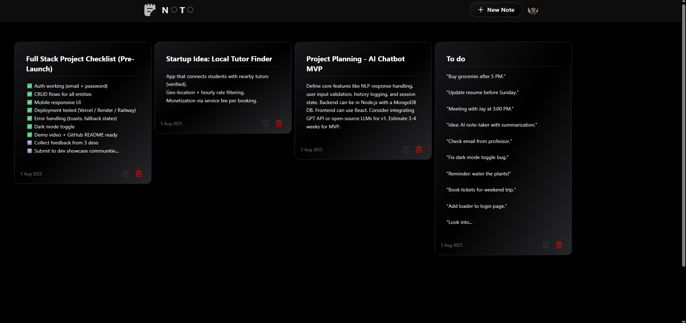

# NOTO - Notes/Task Manager App

Live App: [https://noto-mern.onrender.com](https://noto-mern.onrender.com)

NOTO is a minimalist, full-stack task manager that lets you create, update, and delete tasks with ease. Built using the MERN stack, it offers a smooth, responsive experience for managing your daily to-dos.

## Features

- ✅ Create and manage tasks in real-time  
- ✏️ Edit task titles  
- ❌ Delete tasks  
- 📦 Persistent storage using MongoDB  
- 🔐 Authentication layer (custom implementation planned)  
- 📱 Fully responsive design  

## Tech Stack

- **Frontend:** React, CSS  
- **Backend:** Node.js, Express
- **Auth:** Clerk 
- **Database:** MongoDB (via Mongoose)  
- **Deployment:** Render

## Screenshots

### 💯 Main Page
 
### 📄 Create Note Page
  
### 📝 Edit Note Page


## 🧪 .env Setup
```bash
MONGO_URI=<your_mongo_uri>

UPSTASH_REDIS_REST_URL=<your_redis_rest_url>
UPSTASH_REDIS_REST_TOKEN=<your_redis_rest_token>

NODE_ENV=development
```

## 🔧 Run the Backend
```bash
cd backend
npm install
npm run dev
```

## 🧪 💻 Run the Frontend
```bash
cd frontend
npm install
npm run dev
```

## Why This Project?

This project was built to sharpen my MERN stack skills through a real-world, end-to-end application — not just to learn, but to *own* every part of the stack from frontend to backend with purpose and precision.

---

Made with purpose by [@derarshan](https://github.com/derarshan)  
"ChagaChagaChagaChaga"
